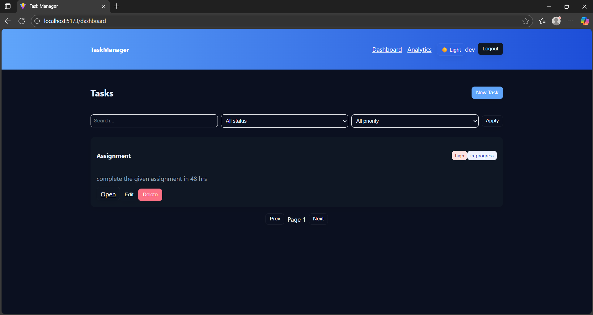
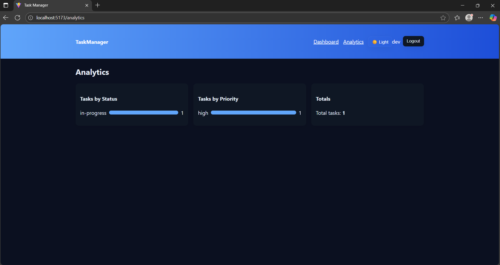

# 🗂️ Task Management System

A full-stack **Task Management Web Application** that allows users to **create, assign, and track tasks**, manage files, and add comments — built using **React (frontend)** and **Express + JSON-based DB (backend)**.

---

## 🚀 Features
- 🔐 JWT-based authentication
- ✅ CRUD for tasks
- 💬 Comment system (no anonymous comments)
- 📎 File uploads & downloads
- 👀 Role-based access for creators and assignees
- 🎨 Clean responsive UI with React

---
## 🖼️ Screenshots / Demo

### 🏠 Dashboard


### 📊 Analytics Page


### 📋 Task Details


## ⚙️ Setup Instructions

### 📦 Clone the Repository

git clone https://github.com/Anjana130997/Task_management.git
---
cd Task_management

## 🧭 Folder Structure

```bash
Task-Management-System/
├── backend/
│   ├── controllers/
│   │   ├── authController.js
│   │   ├── taskController.js
│   │   ├── commentController.js
│   │   └── fileController.js
│   ├── middlewares/
│   │   └── authMiddleware.js
│   ├── routes/
│   │   ├── authRoutes.js
│   │   ├── taskRoutes.js
│   │   ├── commentRoutes.js
│   │   └── fileRoutes.js
│   ├── utils/
│   │   ├── db.js
│   │   └── sanitize.js
│   ├── uploads/
│   ├── db.json
│   ├── server.js
│   ├── package.json
│   └── .env
│
├── frontend/
│   ├── src/
│   │   ├── api/
│   │   │   └── api.js
│   │   ├── components/
│   │   │   ├── TaskCard.jsx
│   │   │   ├── FileUpload.jsx
│   │   │   └── CommentBox.jsx
│   │   ├── context/
│   │   │   └── AuthContext.jsx
│   │   ├── pages/
│   │   │   ├── Login.jsx
│   │   │   ├── Signup.jsx
│   │   │   ├── Dashboard.jsx
│   │   │   └── TaskDetails.jsx
│   │   ├── App.jsx
│   │   └── main.jsx
│   ├── public/
│   ├── package.json
│   ├── vite.config.js
│   └── .env
│
└── README.md
```

🧩 Run the Application

| Step | Command       | Description                               |
| ---- | ------------- | ----------------------------------------- |
| 1️⃣  | `cd backend`  | Move into backend directory               |
| 2️⃣  | `npm install` | Install backend dependencies              |
| 3️⃣  | `npm run dev` | Start backend at `http://localhost:4000`  |
| 4️⃣  | `cd frontend` | Move into frontend directory              |
| 5️⃣  | `npm install` | Install frontend dependencies             |
| 6️⃣  | `npm run dev` | Start frontend at `http://localhost:5173` |


🧠 Architecture Decisions
| Component        | Technology    | Reason                              |
| ---------------- | ------------- | ----------------------------------- |
| Database         | JSON (LowDB)  | Lightweight, easy to manage locally |
| Authentication   | JWT           | Secure and stateless auth           |
| File Handling    | Multer        | Handles uploads efficiently         |
| State Management | React Context | Simpler than Redux for small apps   |
| Routing          | React Router  | Clean navigation between views      |
| Styling          | Custom CSS    | No frameworks; full design control  |


💭 Assumptions Made
| Assumption | Explanation                                              |
| ---------- | -------------------------------------------------------- |
| 1          | Each user only sees their created or assigned tasks      |
| 2          | Only logged-in users can comment (no anonymous comments) |
| 3          | Files limited to 5 MB each                               |
| 4          | JSON file sufficient for demo data                       |
| 5          | Intended to run locally for testing/demo                 |


🧾 API Documentation
Authentication
| Method | Endpoint             | Description              |
| ------ | -------------------- | ------------------------ |
| POST   | `/api/auth/register` | Register new user        |
| POST   | `/api/auth/login`    | Login existing user      |
| GET    | `/api/auth/profile`  | Get current user profile |


Tasks
Method	Endpoint	Description
| Method | Endpoint         | Description    |
| ------ | ---------------- | -------------- |
| GET    | `/api/tasks`     | Get all tasks  |
| GET    | `/api/tasks/:id` | Get task by ID |
| POST   | `/api/tasks`     | Create task    |
| PUT    | `/api/tasks/:id` | Update task    |
| DELETE | `/api/tasks/:id` | Delete task    |


Comments
| Method | Endpoint                   | Description             |
| ------ | -------------------------- | ----------------------- |
| GET    | `/api/comments/:taskId`    | Get comments for a task |
| POST   | `/api/comments/:taskId`    | Add new comment         |
| PUT    | `/api/comments/:commentId` | Edit existing comment   |
| DELETE | `/api/comments/:commentId` | Delete a comment        |


Files
| Method | Endpoint               | Description            |
| ------ | ---------------------- | ---------------------- |
| POST   | `/api/tasks/:id/files` | Upload file for a task |
| GET    | `/uploads/:filename`   | Download uploaded file |
| DELETE | `/api/files/:fileId`   | Delete file            |


🔑 Test User Credentials
| Field    | Value                  |
| -------- | ---------------------- |
| Email    | `testuser@example.com` |
| Password | `123456`               |

